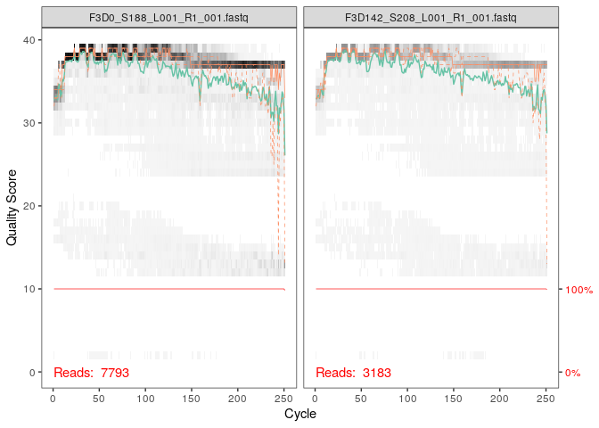

Dada2 tutorial
================
Ysaline PRETTI

  - [Learn the Error Rates](#learn-the-error-rates)
  - [Evaluate accuracy](#evaluate-accuracy)

\#Getting ready Nous avons installé le package Dada2 dans notre scripte
00\_install afin de ne pas encombrer notre espace de travail. Maintenant
nous devons charger la librairie, c’est-à-dire mettre Dada2 dans notre
environnement afin de s’assurer de pouvoir avoir accès lors des run aux
packages.

``` r
library("dada2")
```

    ## Loading required package: Rcpp

Dans notre script 01\_data-import nous avons téléchargé les données sur
lesquelles nous allons travailler. Ce sont des séquences d’ARN 16s
Forwards et Reverse obtenue en Illumina à partir d’échantillons
d’excréments de souris. Nous les avons directement unzipper dans un
dossier nommé “MiSeq\_SOP”. Ici nous indiquons par cette ligne de code
que nous nous plaçons dans ce dossier. Nous assignons le contenu de ce
dossier à l’objet “path” pour simplifier le reste de nos commandes. Par
“list.files(path)” nous demandons à voir la liste de ce qui est
contenue dans le dossier MiSeq\_SOP

``` r
path <- "~/MiSeq_SOP" # CHANGE ME to the directory containing the fastq files after unzipping.
list.files(path)
```

    ##  [1] "F3D0_S188_L001_R1_001.fastq"   "F3D0_S188_L001_R2_001.fastq"  
    ##  [3] "F3D1_S189_L001_R1_001.fastq"   "F3D1_S189_L001_R2_001.fastq"  
    ##  [5] "F3D141_S207_L001_R1_001.fastq" "F3D141_S207_L001_R2_001.fastq"
    ##  [7] "F3D142_S208_L001_R1_001.fastq" "F3D142_S208_L001_R2_001.fastq"
    ##  [9] "F3D143_S209_L001_R1_001.fastq" "F3D143_S209_L001_R2_001.fastq"
    ## [11] "F3D144_S210_L001_R1_001.fastq" "F3D144_S210_L001_R2_001.fastq"
    ## [13] "F3D145_S211_L001_R1_001.fastq" "F3D145_S211_L001_R2_001.fastq"
    ## [15] "F3D146_S212_L001_R1_001.fastq" "F3D146_S212_L001_R2_001.fastq"
    ## [17] "F3D147_S213_L001_R1_001.fastq" "F3D147_S213_L001_R2_001.fastq"
    ## [19] "F3D148_S214_L001_R1_001.fastq" "F3D148_S214_L001_R2_001.fastq"
    ## [21] "F3D149_S215_L001_R1_001.fastq" "F3D149_S215_L001_R2_001.fastq"
    ## [23] "F3D150_S216_L001_R1_001.fastq" "F3D150_S216_L001_R2_001.fastq"
    ## [25] "F3D2_S190_L001_R1_001.fastq"   "F3D2_S190_L001_R2_001.fastq"  
    ## [27] "F3D3_S191_L001_R1_001.fastq"   "F3D3_S191_L001_R2_001.fastq"  
    ## [29] "F3D5_S193_L001_R1_001.fastq"   "F3D5_S193_L001_R2_001.fastq"  
    ## [31] "F3D6_S194_L001_R1_001.fastq"   "F3D6_S194_L001_R2_001.fastq"  
    ## [33] "F3D7_S195_L001_R1_001.fastq"   "F3D7_S195_L001_R2_001.fastq"  
    ## [35] "F3D8_S196_L001_R1_001.fastq"   "F3D8_S196_L001_R2_001.fastq"  
    ## [37] "F3D9_S197_L001_R1_001.fastq"   "F3D9_S197_L001_R2_001.fastq"  
    ## [39] "filtered"                      "HMP_MOCK.v35.fasta"           
    ## [41] "Mock_S280_L001_R1_001.fastq"   "Mock_S280_L001_R2_001.fastq"  
    ## [43] "mouse.dpw.metadata"            "mouse.time.design"            
    ## [45] "stability.batch"               "stability.files"

Une fois les données en visuel nous pouvons maintenant faire une sorte
de tri dans les différents fichiers et les classer en fonction de ce qui
nous intéresse dans des objets pour les futurs codes. Ici nous nommons
fnFs tous les fichier contenant le motif \_R1001.fastq dans son nom, on
ne modifie pas le nom en le gardant entièrement avec “full.names=TRUE”.
Même commandes pour associer à fnRs avec le files contenant
“*R2\_001.fastq". Les commandes contenant "strs" font référence aux
string chains de caractères. Avec "sapply" ont simplifie le noms du
fichier contenue dans fnFs en demandant de couper après le premier "*”,
ils sont maintenant associé à l’objet “sample.names”

``` r
# Forward and reverse fastq filenames have format: SAMPLENAME_R1_001.fastq and SAMPLENAME_R2_001.fastq
fnFs <- sort(list.files(path, pattern="_R1_001.fastq", full.names = TRUE))
fnRs <- sort(list.files(path, pattern="_R2_001.fastq", full.names = TRUE))
# Extract sample names, assuming filenames have format: SAMPLENAME_XXX.fastq
sample.names <- sapply(strsplit(basename(fnFs), "_"), `[`, 1)
```

\#Inspect read quality profiles La on va tracer en graphique les scores
de qualité dans les fnFs du 1 AU 4, pour savoir ou couper après au
moment du trime Par la commande plot nous traçons un graphique de scores
de qualité des séquences, ici nous observons les séquences de fnRS de la
1ère à la 4ème. Cette observons va nous servir à savoir à quel
nucléotide nous voulons faire le trim afin d’obtenir des séquences le
plus net possible.

``` r
plotQualityProfile(fnRs[1:4])
```

<!-- -->
Ici sur le même principe que vu ci-dessus nous observons les fichier 1
ET 4 des fnFs par l’ajout dans la commande “\[c(x,x)\]”.

``` r
plotQualityProfile(fnFs[c(1,4)])
```

<!-- -->
\#Filter and Trim Ici nous créons les fichiers dans lesquels nous allons
ranger nos données une fois filtrées (opération suivante). Ils seront
contenus dans la sous-classe “filtered”. Nous utiliserons les noms
simplifier créés auparavant. Les noms de ces fichiers sont filtFs et
flitRS.

``` r
# Place filtered files in filtered/ subdirectory
filtFs <- file.path(path, "filtered", paste0(sample.names, "_F_filt.fastq.gz"))
filtRs <- file.path(path, "filtered", paste0(sample.names, "_R_filt.fastq.gz"))
names(filtFs) <- sample.names
names(filtRs) <- sample.names
```

Nous utilisons grâce au packages Dada2 la fonction “filterAndTrim”.
Parmis nos fichier fnFs, filtFs, fnRs et filtRs, nous décidons de
tronquer respectivement (c(x,x)) par truncLen au niveau des pb 240 pour
les fnFs et 160 pour les fnRs ( les Forwards étant de meilleurs qualité
que les Reverses par la technique Illumina). La ligne de code composé
des différents “max” sont des paramètres standards de la fonction
filterAndTrim. Avec la commande “head(out)”, c’est pour nous éviter de
faire un print et d’avoir beaucoup trop de données, on demande à voir
seulement les premiers fichiers de la liste. La colonne “reads.in” nous
donne par séquence, le nombre de pb rentré et “reads.out” nous donne le
nombre de pb sortie avec le trim.

``` r
out <- filterAndTrim(fnFs, filtFs, fnRs, filtRs, truncLen=c(240,160),
              maxN=0, maxEE=c(2,2), truncQ=2, rm.phix=TRUE,
              compress=TRUE, multithread=TRUE) # On Windows set multithread=FALSE
head(out)
```

    ##                               reads.in reads.out
    ## F3D0_S188_L001_R1_001.fastq       7793      7113
    ## F3D1_S189_L001_R1_001.fastq       5869      5299
    ## F3D141_S207_L001_R1_001.fastq     5958      5463
    ## F3D142_S208_L001_R1_001.fastq     3183      2914
    ## F3D143_S209_L001_R1_001.fastq     3178      2941
    ## F3D144_S210_L001_R1_001.fastq     4827      4312

# Learn the Error Rates

LA fonction “learnErros” appartient au packages Dada2. Cela nous permet
de calculer un modèles d’erreurs à partir des données de nos séquences,
et donc de savoir s’il y a eu erreurs dans la lecture des bases en
lisant par exemple un T à la place d’un A. On applique cette fonction
sur nos reads forwards et nos reverses. Le “multithread” nous permets de
préciser que cela se fait de façons “multifonction” et donc on précise
que le code peut faire plusieurs choses à la fois. On applique les
résultats de cette fonction à l’objets “errF” pour forward et “errR”
pour reverse. On applique cette méthode sur les reads forward puis les
reverses, multithread=multitask

``` r
errF <- learnErrors(filtFs, multithread=TRUE)
```

    ## 33514080 total bases in 139642 reads from 20 samples will be used for learning the error rates.

``` r
errR <- learnErrors(filtRs, multithread=TRUE)
```

    ## 22342720 total bases in 139642 reads from 20 samples will be used for learning the error rates.

Nous voulons maintenant visualiser les taux d’erreurs estimés. les
titres de chaque tableaux A2A par exemple se lis “A to A” donc “un A en
A”. La ligne noir nous montre les taux d’erreurs estimés par la
fonction, et la ligne rouge les taux d’erreurs estimés selon le score de
Qualité. Nous voyons bien que les erreurs (point noir) correspondants à
la ligne noire “estimé”. Donc pas de différences trop importantes pour
devoir revenir sur nos séquences. De plus, plus le scores de Qualité et
haut, plus le taux d’erreurs diminue.

``` r
plotErrors(errF, nominalQ=TRUE)
```

    ## Warning: Transformation introduced infinite values in continuous y-axis
    
    ## Warning: Transformation introduced infinite values in continuous y-axis

<!-- -->
\#Sample Inference On applique la fonction de dada qui est un algorithme
d’interférence aux données que nous avons filtré et trim, ainsi qu’à
celles ayant eu l’algorithme d’erreurs. Cela nous permet d’enlever les
bruits de fond.

``` r
dadaFs <- dada(filtFs, err=errF, multithread=TRUE)
```

    ## Sample 1 - 7113 reads in 1979 unique sequences.
    ## Sample 2 - 5299 reads in 1639 unique sequences.
    ## Sample 3 - 5463 reads in 1477 unique sequences.
    ## Sample 4 - 2914 reads in 904 unique sequences.
    ## Sample 5 - 2941 reads in 939 unique sequences.
    ## Sample 6 - 4312 reads in 1267 unique sequences.
    ## Sample 7 - 6741 reads in 1756 unique sequences.
    ## Sample 8 - 4560 reads in 1438 unique sequences.
    ## Sample 9 - 15637 reads in 3590 unique sequences.
    ## Sample 10 - 11413 reads in 2762 unique sequences.
    ## Sample 11 - 12017 reads in 3021 unique sequences.
    ## Sample 12 - 5032 reads in 1566 unique sequences.
    ## Sample 13 - 18075 reads in 3707 unique sequences.
    ## Sample 14 - 6250 reads in 1479 unique sequences.
    ## Sample 15 - 4052 reads in 1195 unique sequences.
    ## Sample 16 - 7369 reads in 1832 unique sequences.
    ## Sample 17 - 4765 reads in 1183 unique sequences.
    ## Sample 18 - 4871 reads in 1382 unique sequences.
    ## Sample 19 - 6504 reads in 1709 unique sequences.
    ## Sample 20 - 4314 reads in 897 unique sequences.

``` r
dadaRs <- dada(filtRs, err=errR, multithread=TRUE)
```

    ## Sample 1 - 7113 reads in 1660 unique sequences.
    ## Sample 2 - 5299 reads in 1349 unique sequences.
    ## Sample 3 - 5463 reads in 1335 unique sequences.
    ## Sample 4 - 2914 reads in 853 unique sequences.
    ## Sample 5 - 2941 reads in 880 unique sequences.
    ## Sample 6 - 4312 reads in 1286 unique sequences.
    ## Sample 7 - 6741 reads in 1803 unique sequences.
    ## Sample 8 - 4560 reads in 1265 unique sequences.
    ## Sample 9 - 15637 reads in 3414 unique sequences.
    ## Sample 10 - 11413 reads in 2522 unique sequences.
    ## Sample 11 - 12017 reads in 2771 unique sequences.
    ## Sample 12 - 5032 reads in 1415 unique sequences.
    ## Sample 13 - 18075 reads in 3290 unique sequences.
    ## Sample 14 - 6250 reads in 1390 unique sequences.
    ## Sample 15 - 4052 reads in 1134 unique sequences.
    ## Sample 16 - 7369 reads in 1635 unique sequences.
    ## Sample 17 - 4765 reads in 1084 unique sequences.
    ## Sample 18 - 4871 reads in 1161 unique sequences.
    ## Sample 19 - 6504 reads in 1502 unique sequences.
    ## Sample 20 - 4314 reads in 732 unique sequences.

``` r
dadaRs[[3]]
```

    ## dada-class: object describing DADA2 denoising results
    ## 82 sequence variants were inferred from 1335 input unique sequences.
    ## Key parameters: OMEGA_A = 1e-40, OMEGA_C = 1e-40, BAND_SIZE = 16

\#Merged paired reads Maintenant par la fonction “mergePairs”, nous
fusionnons les reads Forwards et Reverses, afin de former des contigs.
Pour cela nous prenons les données que nous avons filtré et trim
précédemments ainsi que les données “denoised” par dada.Nous nommons
l’objet contenant les objets “mergers” Ici ce que nous devons lire: A
la fin nous avons trouvé 6551 paires de reads, dans celles-ci, en tout
nous avons 106 séquences différentes, provenant d’une entré de 6907
paires de reads contenant 199 séquences différentes. Ou autrement dit,
parmi 6907 séquences entrées dans la fonction, nous avons pu en merge
6551. NB: unique pairings=contigs

``` r
mergers <- mergePairs(dadaFs, filtFs, dadaRs, filtRs, verbose=TRUE)
```

    ## 6551 paired-reads (in 106 unique pairings) successfully merged out of 6907 (in 199 pairings) input.

    ## 5025 paired-reads (in 100 unique pairings) successfully merged out of 5188 (in 156 pairings) input.

    ## 4973 paired-reads (in 80 unique pairings) successfully merged out of 5268 (in 166 pairings) input.

    ## 2595 paired-reads (in 52 unique pairings) successfully merged out of 2756 (in 109 pairings) input.

    ## 2553 paired-reads (in 60 unique pairings) successfully merged out of 2785 (in 119 pairings) input.

    ## 3622 paired-reads (in 53 unique pairings) successfully merged out of 4103 (in 157 pairings) input.

    ## 6079 paired-reads (in 81 unique pairings) successfully merged out of 6515 (in 198 pairings) input.

    ## 3961 paired-reads (in 90 unique pairings) successfully merged out of 4384 (in 188 pairings) input.

    ## 14231 paired-reads (in 143 unique pairings) successfully merged out of 15358 (in 351 pairings) input.

    ## 10526 paired-reads (in 120 unique pairings) successfully merged out of 11166 (in 279 pairings) input.

    ## 11156 paired-reads (in 137 unique pairings) successfully merged out of 11799 (in 298 pairings) input.

    ## 4329 paired-reads (in 84 unique pairings) successfully merged out of 4788 (in 180 pairings) input.

    ## 17431 paired-reads (in 153 unique pairings) successfully merged out of 17812 (in 272 pairings) input.

    ## 5850 paired-reads (in 81 unique pairings) successfully merged out of 6095 (in 159 pairings) input.

    ## 3716 paired-reads (in 86 unique pairings) successfully merged out of 3894 (in 147 pairings) input.

    ## 6865 paired-reads (in 99 unique pairings) successfully merged out of 7193 (in 187 pairings) input.

    ## 4430 paired-reads (in 67 unique pairings) successfully merged out of 4605 (in 127 pairings) input.

    ## 4574 paired-reads (in 100 unique pairings) successfully merged out of 4736 (in 172 pairings) input.

    ## 6094 paired-reads (in 109 unique pairings) successfully merged out of 6314 (in 172 pairings) input.

    ## 4269 paired-reads (in 20 unique pairings) successfully merged out of 4281 (in 28 pairings) input.

Maintenant avec nous demandons à voir le début du tableau des données du
premier échantillon

``` r
# Inspect the merger data.frame from the first sample
head(mergers[[1]])
```

    ##                                                                                                                                                                                                                                                       sequence
    ## 1 TACGGAGGATGCGAGCGTTATCCGGATTTATTGGGTTTAAAGGGTGCGCAGGCGGAAGATCAAGTCAGCGGTAAAATTGAGAGGCTCAACCTCTTCGAGCCGTTGAAACTGGTTTTCTTGAGTGAGCGAGAAGTATGCGGAATGCGTGGTGTAGCGGTGAAATGCATAGATATCACGCAGAACTCCGATTGCGAAGGCAGCATACCGGCGCTCAACTGACGCTCATGCACGAAAGTGTGGGTATCGAACAGG
    ## 2 TACGGAGGATGCGAGCGTTATCCGGATTTATTGGGTTTAAAGGGTGCGTAGGCGGCCTGCCAAGTCAGCGGTAAAATTGCGGGGCTCAACCCCGTACAGCCGTTGAAACTGCCGGGCTCGAGTGGGCGAGAAGTATGCGGAATGCGTGGTGTAGCGGTGAAATGCATAGATATCACGCAGAACCCCGATTGCGAAGGCAGCATACCGGCGCCCTACTGACGCTGAGGCACGAAAGTGCGGGGATCAAACAGG
    ## 3 TACGGAGGATGCGAGCGTTATCCGGATTTATTGGGTTTAAAGGGTGCGTAGGCGGGCTGTTAAGTCAGCGGTCAAATGTCGGGGCTCAACCCCGGCCTGCCGTTGAAACTGGCGGCCTCGAGTGGGCGAGAAGTATGCGGAATGCGTGGTGTAGCGGTGAAATGCATAGATATCACGCAGAACTCCGATTGCGAAGGCAGCATACCGGCGCCCGACTGACGCTGAGGCACGAAAGCGTGGGTATCGAACAGG
    ## 4 TACGGAGGATGCGAGCGTTATCCGGATTTATTGGGTTTAAAGGGTGCGTAGGCGGGCTTTTAAGTCAGCGGTAAAAATTCGGGGCTCAACCCCGTCCGGCCGTTGAAACTGGGGGCCTTGAGTGGGCGAGAAGAAGGCGGAATGCGTGGTGTAGCGGTGAAATGCATAGATATCACGCAGAACCCCGATTGCGAAGGCAGCCTTCCGGCGCCCTACTGACGCTGAGGCACGAAAGTGCGGGGATCGAACAGG
    ## 5 TACGGAGGATGCGAGCGTTATCCGGATTTATTGGGTTTAAAGGGTGCGCAGGCGGACTCTCAAGTCAGCGGTCAAATCGCGGGGCTCAACCCCGTTCCGCCGTTGAAACTGGGAGCCTTGAGTGCGCGAGAAGTAGGCGGAATGCGTGGTGTAGCGGTGAAATGCATAGATATCACGCAGAACTCCGATTGCGAAGGCAGCCTACCGGCGCGCAACTGACGCTCATGCACGAAAGCGTGGGTATCGAACAGG
    ## 6 TACGGAGGATGCGAGCGTTATCCGGATTTATTGGGTTTAAAGGGTGCGTAGGCGGGATGCCAAGTCAGCGGTAAAAAAGCGGTGCTCAACGCCGTCGAGCCGTTGAAACTGGCGTTCTTGAGTGGGCGAGAAGTATGCGGAATGCGTGGTGTAGCGGTGAAATGCATAGATATCACGCAGAACTCCGATTGCGAAGGCAGCATACCGGCGCCCTACTGACGCTGAGGCACGAAAGCGTGGGTATCGAACAGG
    ##   abundance forward reverse nmatch nmismatch nindel prefer accept
    ## 1       579       1       1    148         0      0      1   TRUE
    ## 2       470       2       2    148         0      0      2   TRUE
    ## 3       449       3       4    148         0      0      1   TRUE
    ## 4       430       4       3    148         0      0      2   TRUE
    ## 5       345       5       6    148         0      0      1   TRUE
    ## 6       282       6       5    148         0      0      2   TRUE

\#Construct sequence table Nous allons maintenant pouvoir faire une
table de séquences à partir des merges obtenues, qui sont dans notre
objet “mergers”. Nous pouvons faire ça avec une fonction
“makeSequenceTabl” faisant partie du package dada2. Ce que nous lisons
en sortie: Dans 0 échantillons, on a un total de 293 séquences unique

``` r
seqtab <- makeSequenceTable(mergers)
dim(seqtab)
```

    ## [1]  20 293

Ici nous voulons savoir la taille de nos 293 séquences, Pour lire la
commande: On prend les séquences contenues dans “getSequence” que l’on
trouvera dans la table “seqtab”, et par la commande “nchar”, on demande
à savoir la taille de chacune. La ligne supérieure de la table nous
indique la taille des séquences et la ligne inférieur le nombre de
séquences de cette taille.

``` r
# Inspect distribution of sequence lengths
table(nchar(getSequences(seqtab)))
```

    ## 
    ## 251 252 253 254 255 
    ##   1  88 196   6   2

\#Removes chimeras Les chimères nous faussent les lectures, elles
apparaissant lorsqu’il y a chevauchement entre séquences des deux
espèces différentes par exemple. Nous voulons les supprimer Pour lire
la commande: Par la fonction “removeBimerasDenovo”, nous enlevons les
nouvelles séquences (non comparables avec ce que l’on connait déjà)
étant des bimères, nous appliquons cette fonction à nos séquences de
l’objet “seqtab” (contenant nos merges). C’est assigner à l’objet
seqtab.nochim. La commande dim nous donne la dimension de la table Nous
lisons que la fonction a identifié 61 chimères dans nos 293 et donc une
fois enlevé nous avons un total de 232 séquences sur 20 échantillons.

``` r
seqtab.nochim <- removeBimeraDenovo(seqtab, method="consensus", multithread=TRUE, verbose=TRUE)
```

    ## Identified 61 bimeras out of 293 input sequences.

``` r
dim(seqtab.nochim)
```

    ## [1]  20 232

Maintenant nous voulons lire en pourcentage le taux de chimères pour
nous faire une meilleure idée. Nous divisons la totalité de nos
séquences sans chimères par nos séquences avec chimères. Le pourcentage
obtenues nous donne le taux de séquences non chimériques. Si nous le 1-
devant la formule, nous obtenue l’inverse et donc le taux de séquences
chimériques. Il y a 96,5% de non chimériques dans notre jeu de données,
avec le 1- nous avons 3,5% de chimérique

``` r
sum(seqtab.nochim)/sum(seqtab)
```

    ## [1] 0.964263

\#Track reads through the pipeline Nous regardons l’évolution des
séquences par échantillons au fur et à mesure de nos différentes
interventions, filtrage, fusions etc.

Dans ce code nous définissons la fonctions getUnique qui nous permettras
d’extraire des séquences uniques des jeux de données voulus. Cette
fonction est e à getN. Ce dernier sera appliqué à nos différentes
données contenues dans nos dadaFs et Rs, nos merges et nos nochim. On
définit bien avec “out” que nous voulons que les sorties de ces jeux de
données. Puis nous définitssons tout simplement les noms des colonnes
par “colnames” en fonctions de ce que nous ressortirons de track. De
même pour les ranger avec “rownames”. On finit avec un print pour voir
notre beau tableau de trackage/suivi de données.

``` r
getN <- function(x) sum(getUniques(x))
track <- cbind(out, sapply(dadaFs, getN), sapply(dadaRs, getN), sapply(mergers, getN), rowSums(seqtab.nochim))
# If processing a single sample, remove the sapply calls: e.g. replace sapply(dadaFs, getN) with getN(dadaFs)
colnames(track) <- c("input", "filtered", "denoisedF", "denoisedR", "merged", "nonchim")
rownames(track) <- sample.names
print(track)
```

    ##        input filtered denoisedF denoisedR merged nonchim
    ## F3D0    7793     7113      6996      6978   6551    6539
    ## F3D1    5869     5299      5227      5239   5025    5014
    ## F3D141  5958     5463      5339      5351   4973    4850
    ## F3D142  3183     2914      2799      2833   2595    2521
    ## F3D143  3178     2941      2822      2868   2553    2519
    ## F3D144  4827     4312      4146      4224   3622    3483
    ## F3D145  7377     6741      6593      6628   6079    5820
    ## F3D146  5021     4560      4448      4466   3961    3872
    ## F3D147 17070    15637     15437     15507  14231   13004
    ## F3D148 12405    11413     11251     11268  10526    9938
    ## F3D149 13083    12017     11858     11899  11156   10653
    ## F3D150  5509     5032      4863      4928   4329    4248
    ## F3D2   19620    18075     17907     17939  17431   16835
    ## F3D3    6758     6250      6145      6176   5850    5486
    ## F3D5    4448     4052      3930      3994   3716    3716
    ## F3D6    7989     7369      7236      7295   6865    6678
    ## F3D7    5129     4765      4648      4671   4430    4219
    ## F3D8    5294     4871      4784      4799   4574    4545
    ## F3D9    7070     6504      6341      6442   6094    6017
    ## Mock    4779     4314      4287      4286   4269    4269

\#Assigne Taxonomy Par le bash “wget” nous allons extraire du lien, sur
le site de silva, les données d’attribution de taxonomie afin de savoir
à quelles espèces appartiennent nos séquences une fois “purifier” à
notre volonté.

``` bash
wget https://zenodo.org/record/3986799/files/silva_nr99_v138_train_set.fa.gz
```

Par la fonction de Dada2 “assignTaxonomy” compare notre seq.tabnochim et
les données préalablement téléchargées qui se situent dans Home\~ du nom
de silva\_nr99\_v138\_train\_set.fa.gz .

``` r
taxa <- assignTaxonomy(seqtab.nochim, "~/silva_nr99_v138_train_set.fa.gz", multithread=TRUE)
```

Sur le même principe on retourne sur silva chercher de nouvelles données
d’assignements

``` bash
wget https://zenodo.org/record/3986799/files/silva_species_assignment_v138.fa.gz
```

Avec ces nouvelles données on ajoute à la taxonomie l’assignement des
espèces, c’est donc plus précis.

``` r
taxa<- addSpecies(taxa, "~/silva_species_assignment_v138.fa.gz")
```

Toutes ces téléchargements ont été associé à l’objet “taxa” que l’on
renomme “taxa.print” tout en précisant par la suite de ne pas montrer le
nom des rangers, et on fait un aperçu du début du tableau avec “head”.

``` r
taxa.print <- taxa # Removing sequence rownames for display only
rownames(taxa.print) <- NULL
head(taxa.print)
```

    ##      Kingdom    Phylum         Class         Order           Family          
    ## [1,] "Bacteria" "Bacteroidota" "Bacteroidia" "Bacteroidales" "Muribaculaceae"
    ## [2,] "Bacteria" "Bacteroidota" "Bacteroidia" "Bacteroidales" "Muribaculaceae"
    ## [3,] "Bacteria" "Bacteroidota" "Bacteroidia" "Bacteroidales" "Muribaculaceae"
    ## [4,] "Bacteria" "Bacteroidota" "Bacteroidia" "Bacteroidales" "Muribaculaceae"
    ## [5,] "Bacteria" "Bacteroidota" "Bacteroidia" "Bacteroidales" "Bacteroidaceae"
    ## [6,] "Bacteria" "Bacteroidota" "Bacteroidia" "Bacteroidales" "Muribaculaceae"
    ##      Genus         Species
    ## [1,] NA            NA     
    ## [2,] NA            NA     
    ## [3,] NA            NA     
    ## [4,] NA            NA     
    ## [5,] "Bacteroides" NA     
    ## [6,] NA            NA

# Evaluate accuracy

Mock est une communauté créer par nous-mêmes, elle contient 20 souches
connues déjà séquencées. Cette étape nous permet de vérifier
l’exactitude des étapes appliqué par Dada2 sur nos échantillons pour
déterminer s’il existe un taux d’erreurs. On vérifie donc si Dada2 peut
retrouver le nombre de souches contenue dans la communauté mock. Ici
c’est exact. Puis on recompare aux données que Dada2 était supposé
trouver en allant les récupérer dans le fichier HMP\_MOCK.v35.fasta.
Encore une fois c’était exacte.

``` r
unqs.mock <- seqtab.nochim["Mock",]
unqs.mock <- sort(unqs.mock[unqs.mock>0], decreasing=TRUE) # Drop ASVs absent in the Mock
cat("DADA2 inferred", length(unqs.mock), "sample sequences present in the Mock community.\n")
```

    ## DADA2 inferred 20 sample sequences present in the Mock community.

``` r
mock.ref <- getSequences(file.path(path, "HMP_MOCK.v35.fasta"))
match.ref <- sum(sapply(names(unqs.mock), function(x) any(grepl(x, mock.ref))))
cat("Of those,", sum(match.ref), "were exact matches to the expected reference sequences.\n")
```

    ## Of those, 20 were exact matches to the expected reference sequences.

Maintenant nous chargeons notre library phyloseq pour des analyses plus
précises sur nos communautés de d’excréments de souris.

``` r
library(phyloseq); packageVersion("phyloseq")
```

    ## [1] '1.32.0'

``` r
save.image(file="02_data-analysis-with-DADA2_FinalEnv")
```
